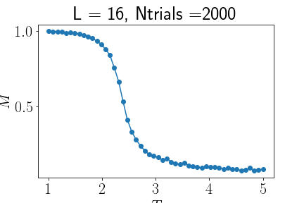
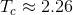

# Wolf algorithm for the Ising model

## Presentation

WolfCpp is a C++11 implementation of the ferromagnetic Ising model. I tried to mimic as much as possible the python implementation made in [this github repo](https://github.com/SneachChea/Wolf-Monte-Carlo-Ising). It uses intensively the stl C++ library and only output the magnetization as a function of temperature.

## Compilation

Tested with g++ 4.2.1 on macOs and linux. In order to compile, just use your favorite terminal and run the command
```
make
```
on the source folder.

## How to use the program?

### BEWARE: PARAMATERS ARE CASE SENSITIVE.

The program relies mainly on the paramaters in the param.dat file:
- L: the number of lattice site on each rows. The lattice being a square lattice, the total number of spin in the lattice is N=L*L
- Ntrials: the number of trials for a Monte-Carlo simulation, *i.e* the number of Monte-Carlo iterations. The higher, the better. Once the system is converged, their is no need to iterate again.
- nT: Number of temperature point in the interval [Tmin,Tmax].
- Tmin: smallest value of the temperature.
- Tmax: largest vlaue of the temperature.

## Physics

The (normalized) magnetization as a function of the temperature is output in the file nammed ``` magentization_L```*l*```_Ntrials```*ntrials*```.dat```, where *l* and *ntrials* are the numerical values of L and Ntrials.
For instance, here is a plot of the magnetization for L=16, Ntrials=2000.



We clearly see a second-order phase transition occuring at . The finite size of the lattice explains why we do not see a first-order phase transition.


## Possible improvements

Here is a list of possible improvements:
* Use Cmake to simplify the compilation.
* Use a standard JSON file to read parameters. 
* Output the thermalized lattice state at the end of a Monte-Carlo simulation
* Output the energy, the specific heat and the mean value of the cluster size for each temperature.
* Parallelization using MPI (Maybe in another repo).
